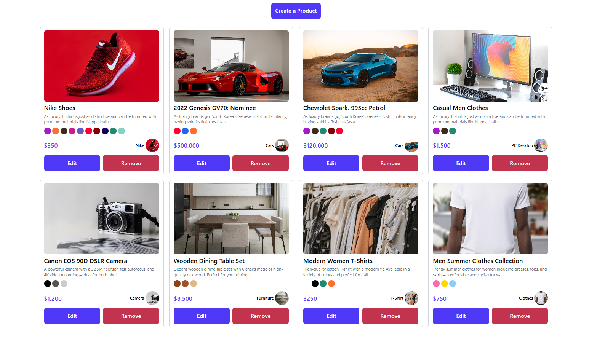

# 🛒 Product Management App (React + TypeScript)

A dynamic and fully interactive **Product CRUD (Create, Read, Update, Delete)** application built using **React**, **TypeScript**, and **Tailwind CSS**. It provides a clean, responsive UI to manage products with rich features such as validation, toast notifications, modal forms, color/category selection, and more.

## 🚀 Tech Stack

- **React** – UI library for building user interfaces
- **TypeScript** – Strong typing and scalability
- **Tailwind CSS** – Utility-first CSS framework
- **react-hot-toast** – Lightweight toast notifications
- **uuid** – Unique product ID generation

---

## ✨ Features

### ✅ Create Product
- Modal form with input fields for title, description, image URL, and price.
- Color selection and category dropdown.
- Form validation with error messages.
- Generates a unique product ID using `uuid`.

### ✅ Read Products
- Display all products in a responsive grid layout.
- ProductCard component for clean representation.

### ✅ Update Product
- Edit modal with pre-filled data.
- Allows color and category updates.
- Dynamic validation before submitting changes.

### ✅ Delete Product
- Confirmation modal before deletion.
- Removes the product from the list on confirmation.

### ✅ Toast Notifications
- Displays success messages for Add, Edit, and Delete actions.

### ✅ Form Validation
- Ensures required fields are not empty.
- Error messages shown beside respective fields.

---

## 📸 Preview

---

## 🚀 Live Demo  

[🔗 Live Demo Here](https://reactjs-crud-system.netlify.app)  